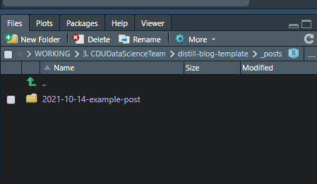

```{r setup, include=FALSE}
knitr::opts_chunk$set(echo = FALSE)
```

# Create a post

Type `distill::create_post("Example post")` and the folder is set up with the date run in the name in the folder `_posts` 

There are further details on posts on the [RStudio {distill} site](https://rstudio.github.io/distill/blog.html#creating-a-post).


# Knit the post

Once the post has been created, knit this to create an html page by either using the Knit button in RStudio (a ball of wool with needles icon) or typing the shortcut keys <kbd> Ctrl + Shift + K </kbd>.


