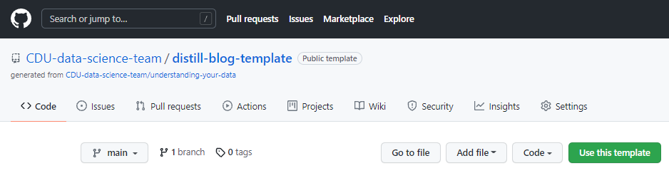
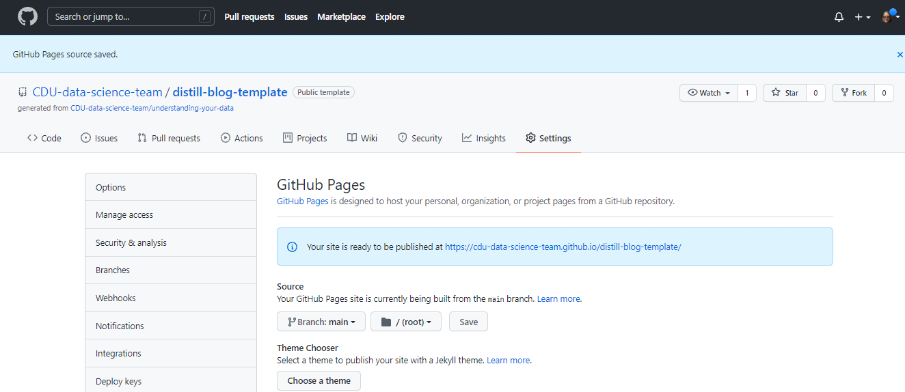

```{r setup, include=FALSE}
knitr::opts_chunk$set(echo = FALSE)
```

# Background

Setting up a {distill} site for blogging is relatively straight forward but can be daunting if you are new to R or new to blog sites. This skeleton has been set up from an [existing blog site](https://cdu-data-science-team.github.io/understanding-your-data/) from the CDU Data Science Team in Nottinghamshire Healthcare NHS Foundation Trust to explain the parts of the site and also to act as a ready template for a new site.

# Resources

The supporting site for [{distill}](https://rstudio.github.io/distill/) is a great resource which links to [example sites](https://pkgs.rstudio.com/distill/articles/examples.html) and is, itself, a {distill} site which uses much of its features. 

# Copying the template

This repository in GitHub has been set to be a template site and in selecting the green button that says `Template` it is possible to copy the repository and also, usefully, remove all branches and history commits so the repository starts in a cleaner state.

# GitHub Actions

{distill} sites rely upon being built as part of the coding. In RStudio this can be done using the Build tab/Build Website button in the (default area) top right panel. Code can be used in the Console to do this:

`rmarkdown::render_site(encoding = 'UTF-8')`

After a post has been written it needs to be `rendered` to html and then the site needs to be built but to save this work it is possible to have this all coded for GitHub to run a GitHub Action. In the folder called `.github/workflows/` the file `main.yml` contains all the code that is required to build the website automatically. 

On GitHub the Actions can be found from its own tab:

.

As the yml has already been set up for this template repository the following is needed to set up the other necessary parts and these next steps are taken from [Matt Dray's blog](https://www.rostrum.blog/2020/08/09/ghactions-pkgs/) which is for a different Action but is still very useful:

Note that this is code that needs to be written in the Terminal tab of RStudio or through something like `Git Bash` as this is working with Git and not R.

> Set-up an empty ‘gh-pages’ branch in your [repo (the book has some code to do this from the command line)](https://orchid00.github.io/actions_sandbox/websites-using-pkgdown-bookdown-and-blogdown.html)

Note that the last line from the book says `git checkout master` and GitHub has moved to naming the default branch to `main` so you won't have a `master` branch and this last line should error. 

(@) From your repo settings, set GitHub Pages to serve from the root of the gh-pages branch

This is referring to the tab Settings in GitHub and although Matt's instructions say to use `root`, this repository works from `docs`:



(@) Wait a few minutes and navigate to your site (in the form ‘username.github.io/reponame’)

!!

Because the GitHub Action builds the site on GitHub every time a push is made, the new commits made remotely will need to be pulled locally as it will be ahead. Getting into the habit of using `pull` before pushing any local work to GitHub is good practice as it's valuable to do this when collaborating with others so you always get any updates others have made.